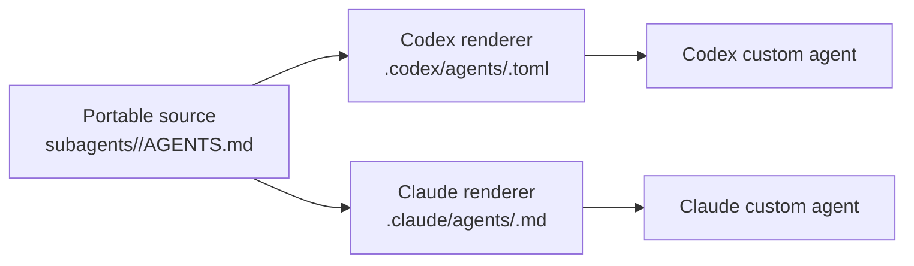

# Codex Subagents Support

Agentwheel supports Codex `subagents` as native Codex custom agent files.

Codex and Claude both expose subagent-style workflows, but their file formats differ:

- Claude subagents are standalone Markdown definitions under `.claude/agents/<name>.md`.
- Codex subagents are standalone TOML custom agent definitions under `.codex/agents/`.

## Harness Map



The source remains portable Markdown. Agentwheel adapts only the installed
artifact shape required by each harness; it does not prescribe a fleet-wide
model policy.

## Installed Targets

| Installation type | Target |
|---|---|
| `local` | `.codex/agents/<name>.toml` |
| `user` | `~/.codex/agents/<name>.toml` |

Agentwheel must not install Codex subagents as `.codex/agents/<name>/AGENTS.md`.

## Source Formats

OpenPack packages may provide Codex-compatible subagents in any of these forms:

```text
subagents/reviewer.toml
subagents/reviewer.md
subagents/reviewer/AGENTS.md
```

Users select them with the extensionless artifact selector:

```text
subagents/reviewer
```

## Rendering Rules

TOML sources are pass-through after basic validation that these required Codex custom agent fields
are present:

```toml
name = "reviewer"
description = "PR reviewer focused on correctness and missing tests."
developer_instructions = """
Review code like an owner.
Prioritize correctness, regressions, and missing tests.
"""
```

Markdown sources are rendered to TOML:

```text
subagents/reviewer.md -> .codex/agents/reviewer.toml
subagents/reviewer/AGENTS.md -> .codex/agents/reviewer.toml
```

Generated fields:

- `name`: file or directory basename without `.md` or `.toml`.
- `description`: frontmatter `description`, else first meaningful Markdown heading or line, else stable fallback.
- `developer_instructions`: Markdown body.
- `model`: preserved from string frontmatter when present.
- `model_reasoning_effort`: preserved from string frontmatter when present.

Other optional Codex custom agent fields can be added later without changing the OpenPack artifact
kind: `nickname_candidates`, `sandbox_mode`, `mcp_servers`, and `skills.config`.

For Claude, Agentwheel flattens `subagents/<name>/AGENTS.md` to
`.claude/agents/<name>.md` without changing its Markdown or YAML frontmatter. This keeps portable
role sources compatible with Claude's documented custom-agent discovery path.

## Coverage

Implemented tests cover:

- Codex local and user path resolution to `.codex/agents/<name>.toml`.
- TOML pass-through install.
- Markdown file conversion.
- Directory `AGENTS.md` conversion.
- Extensionless selection with `subagents/<name>`.
- Negative check that Codex does not write `.codex/agents/<name>/AGENTS.md`.
- Required-field validation for TOML pass-through.
- Claude directory sources render to `.claude/agents/<name>.md` with frontmatter preserved.

## References

- <https://developers.openai.com/codex/subagents>
- <https://developers.openai.com/codex/config-advanced>
- <https://developers.openai.com/codex/guides/agents-md>
